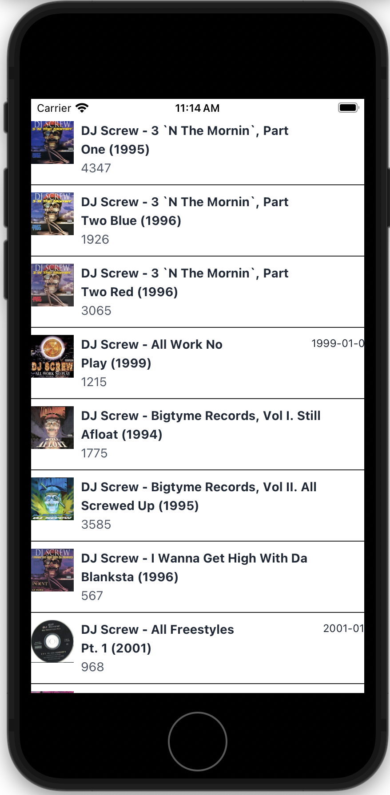
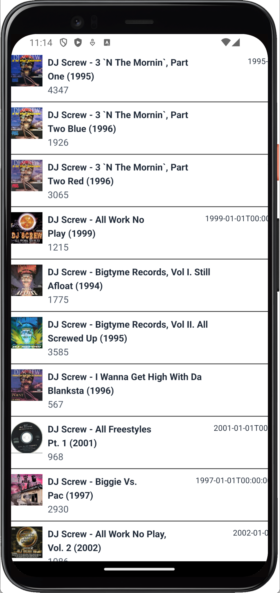

<p align='center'>
  
  <h1 align='center'>ScrewTapp</h1>
  <h3 align='center'>React Native App to Play DJ Screw Mixtapes on Archive.Org on iOS and Android</h2>
</p>

<div align='center' style="display: flex; justify-content: center; align-items: center;">
  
  
</div>

There were lots of apps to stream the jam band shows on archive.org, but none for the trove of DJ Screw mixtapes. So I made one. Currently in alpha, but you can try out the code with Expo Go.

## Built With

- 📱 React Native / Expo
- ▶️ React Native Track Player
- 🚦 Expo Router
- 🗃️ Redux / RTK Query
- ⚡️ FlashList
- 📄 React Native Paper
- 📘 TypeScript

Sure, here's a basic structure for your README.md file. You can replace the placeholders with the actual information about your project.

## Usage

To start the application, clone this repo, run the following command and follow the prompts to launch Expo Go:

```sh
npm start
```

## Contributing

Pull requests are welcome. For major changes, please open an issue first to discuss what you would like to change.

## License

[MIT](https://choosealicense.com/licenses/mit/)
