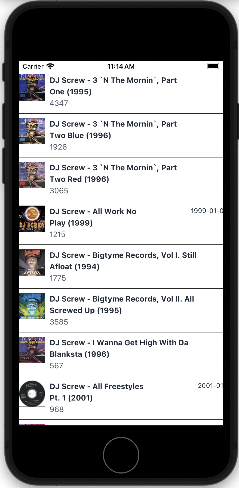
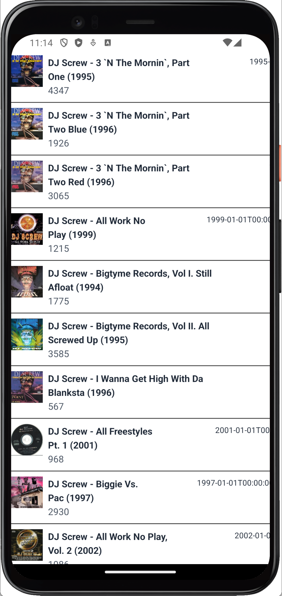

<p align='center'>
  
  <h1 align='center'>ScrewTapp</h1>
  <h3 align='center'>React Native App to Play DJ Screw Mixtapes on Archive.Org on iOS and Android</h2>
</p>

<div align='center' style="display: flex; justify-content: center; align-items: center;">
  
  
</div>

There were lots of apps to stream the jam band shows on archive.org, but none for the trove of DJ Screw mixtapes. So I made one.

## Built With

- React Native 0.81 / Expo SDK 54 (New Architecture)
- React Native Track Player v5
- Expo Router v6
- Redux Toolkit / RTK Query
- FlashList v2
- React Native Paper (Material Design 3)
- TypeScript 5.9

## Prerequisites

- Node.js 22 LTS (the project pins this via [Volta](https://volta.sh/))
- [Xcode](https://developer.apple.com/xcode/) (for iOS)
- [Android Studio](https://developer.android.com/studio) (for Android)
- [CocoaPods](https://cocoapods.org/) (`gem install cocoapods`)

## Getting Started

```sh
# Clone the repo
git clone https://github.com/johnhamlin/screwtapp.git
cd screwtapp

# Install dependencies
npm install

# Generate native projects
npx expo prebuild --clean

# Run on iOS simulator
npm run ios

# Run on Android emulator
npm run android
```

## Scripts

| Command | Description |
|---------|-------------|
| `npm run start` | Start Expo dev server |
| `npm run ios` | Build and run on iOS |
| `npm run android` | Build and run on Android |
| `npm run ts:check` | TypeScript type checking |
| `npm run lint` | ESLint |
| `npm run preview:ios` | Local EAS build for iOS (preview profile) |
| `npm run preview:android` | Local EAS build for Android (preview profile) |

## Contributing

Pull requests are welcome. For major changes, please open an issue first to discuss what you would like to change.

## License

[MIT](https://choosealicense.com/licenses/mit/)
